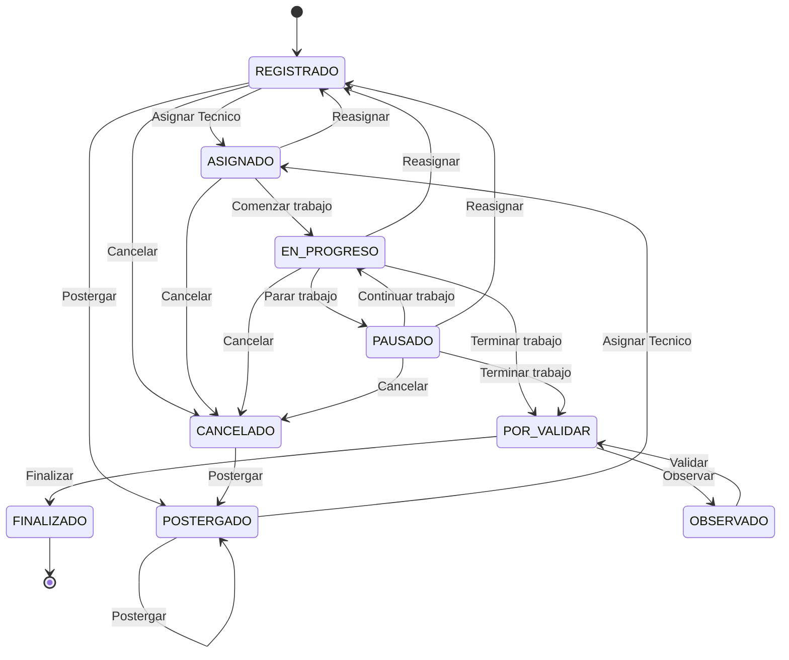

## 🟢 Estados del Pendiente

## 🟢 Subestadis ocacionales del Pendiente

```mermaid

stateDiagram-v2
    [*] --> OK

    OK --> PENDIENTE_PPPoE : Solicitar PPPoE
    OK --> PENDIENTE_VLAN : Solicitar VLAN

    PENDIENTE_PPPoE --> PENDIENTE_PPPoE_Y_VLAN : Solicitar VLAN
    PENDIENTE_VLAN --> PENDIENTE_PPPoE_Y_VLAN : Solicitar PPPoE

    PENDIENTE_PPPoE --> OK : PPPoE configurado
    PENDIENTE_VLAN --> OK : VLAN configurada
    PENDIENTE_PPPoE_Y_VLAN --> OK : Configuración completa
```

## Matriz de permisos y acciones

| AccionPendiente ↓ / Permiso → | REGISTRAR_PENDIENTE | EDITAR_PENDIENTE | VER_DETALLE | VER_TODOS | ASIGNAR_TECNICO | EJECUTAR_TRABAJO | CONFIGURAR_PPOE | CONFIGURAR_VLAN | CANCELAR_PENDIENTE | POSTERGAR_PENDIENTE | FINALIZAR_PENDIENTE | OBSERVAR_PENDIENTE | REGISTRAR_PAGO | VER_HISTORIAL |
| ----------------------------- | ------------------- | ---------------- | ----------- | --------- | --------------- | ---------------- | --------------- | --------------- | ------------------ | ------------------- | ------------------- | ------------------ | -------------- | ------------- |
| ASIGNAR_TECNICO               | —                   | —                | —           | —         | ✅              | —                | —               | —               | —                  | —                   | —                   | —                  | —              | —             |
| REASIGNAR_TECNICO             | —                   | —                | —           | —         | ✅              | ✅                | —               | —               | —                  | —                   | —                   | —                  | —              | —             |
| COMENZAR_TRABAJO              | —                   | —                | —           | —         | —               | ✅                | —               | —               | —                  | —                   | —                   | —                  | —              | —             |
| PARAR_TRABAJO                 | —                   | —                | —           | —         | —               | ✅                | —               | —               | —                  | —                   | —                   | —                  | —              | —             |
| CONTINUAR_TRABAJO             | —                   | —                | —           | —         | —               | ✅                | —               | —               | —                  | —                   | —                   | —                  | —              | —             |
| TERMINAR_TRABAJO              | —                   | —                | —           | —         | —               | ✅                | —               | —               | —                  | —                   | —                   | —                  | —              | —             |
| FINALIZAR                     | —                   | —                | —           | —         | —               | —                | —               | —               | —                  | —                   | ✅                   | —                  | —              | —             |
| OBSERVAR                      | —                   | —                | —           | —         | —               | —                | —               | —               | —                  | —                   | —                   | ✅                  | —              | —             |
| CANCELAR                      | —                   | —                | —           | —         | —               | —                | —               | —               | ✅                  | —                   | —                   | —                  | —              | —             |
| POSTERGAR                     | —                   | —                | —           | —         | —               | —                | —               | —               | —                  | ✅                   | —                   | —                  | —              | —             |
| PEDIR_PPOE                    | —                   | —                | —           | —         | —               | ✅                | ✅               | —               | —                  | —                   | —                   | —                  | —              | —             |
| ASIGNAR_PPOE                  | —                   | —                | —           | —         | —               | —                | ✅               | —               | —                  | —                   | —                   | —                  | —              | —             |
| PEDIR_VLAN                    | —                   | —                | —           | —         | —               | ✅                | —               | ✅               | —                  | —                   | —                   | —                  | —              | —             |
| ASIGNAR_VLAN                  | —                   | —                | —           | —         | —               | —                | —               | ✅               | —                  | —                   | —                   | —                  | —              | —             |
| EDITAR_PENDIENTE              | —                   | ✅                | —           | —         | —               | —                | —               | —               | —                  | —                   | —                   | —                  | —              | —             |
| REGISTRAR_PAGO                | —                   | —                | —           | —         | —               | —                | —               | —               | —                  | —                   | —                   | —                  | ✅              | —             |
| VER_DETALLE                   | —                   | —                | ✅           | —         | —               | —                | —               | —               | —                  | —                   | —                   | —                  | —              | —             |
| VER_HISTORIAL                 | —                   | —                | —           | —         | —               | —                | —               | —               | —                  | —                   | —                   | —                  | —              | ✅             |
| REVISAR_PAGOS                 | —                   | —                | —           | —         | —               | —                | —               | —               | —                  | —                   | —                   | —                  | ✅              | —             |
